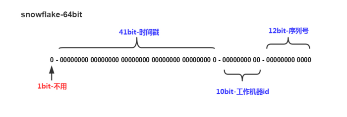
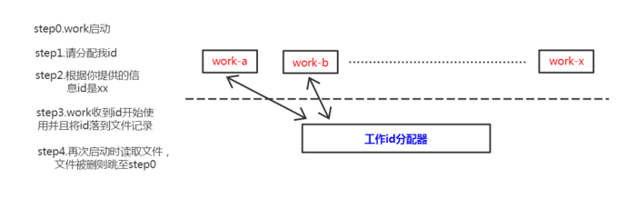
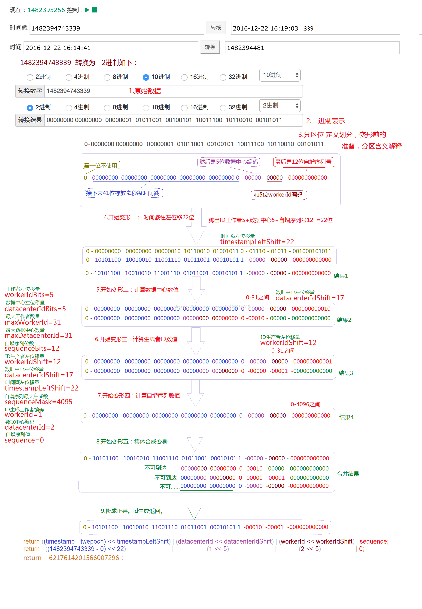

# snowflake——ID生成算法

Twitter的分布式自增ID算法snowflake (Java版)

#### 1、背景
Twitter-Snowflake算法产生的背景相当简单，为了满足Twitter每秒上万条消息的请求，每条消息都必须分配一条唯一的id，这些id还需要一些大致的顺序（方便客户端排序），并且在分布式系统中不同机器产生的id必须不同。
#### 2、Snowflake算法核心
把时间戳，工作机器id，序列号组合在一起。  
  
snowflake除了最高位bit标记为不可用以外，其余三组bit占位均可浮动，看具体的业务需求而定。默认情况下41bit的时间戳可以支持该算法使用到2082年，10bit的工作机器id可以支持1023台机器，序列号支持1毫秒产生4095个自增序列id。下文会具体分析。
##### 2.1 Snowflake – 时间戳
这里时间戳的细度是毫秒级，具体代码如下，建议使用64位linux系统机器，因为有vdso，gettimeofday()在用户态就可以完成操作，减少了进入内核态的损耗。  
```javascript
uint64_t generateStamp(){  
  timeval tv;  
  gettimeofday(&tv, 0);  
  return (uint64_t)tv.tv_sec * 1000 + (uint64_t)tv.tv_usec / 1000;  
} 
```
默认情况下有41个bit可以供使用，那么一共有T（1llu << 41）毫秒供你使用分配，年份 = T / (3600 * 24 * 365 * 1000) = 69.7年。如果你只给时间戳分配39个bit使用，那么根据同样的算法最后年份 = 17.4年。
##### 2.2 Snowflake – 工作机器id
严格意义上来说这个bit段的使用可以是进程级，机器级的话你可以使用MAC地址来唯一标示工作机器，工作进程级可以使用IP+Path来区分工作进程。如果工作机器比较少，可以使用配置文件来设置这个id是一个不错的选择，如果机器过多配置文件的维护是一个灾难性的事情。
这里的解决方案是需要一个工作id分配的进程，可以使用自己编写一个简单进程来记录分配id，或者利用Mysql auto_increment机制也可以达到效果。  
  
工作进程与工作id分配器只是在工作进程启动的时候交互一次，然后工作进程可以自行将分配的id数据落文件，下一次启动直接读取文件里的id使用。  
PS：这个工作机器id的bit段也可以进一步拆分，比如用前5个bit标记进程id，后5个bit标记线程id之类:D  
##### 2.3 Snowflake – 序列号
序列号就是一系列的自增id（多线程建议使用atomic），为了处理在同一毫秒内需要给多条消息分配id，若同一毫秒把序列号用完了，则“等待至下一毫秒”。
```javascript
uint64_t waitNextMs(uint64_t lastStamp){
    uint64_t cur = 0;
    do {
        cur = generateStamp();
    } while (cur <= lastStamp);
    return cur;
}
```
总体来说，是一个很高效很方便的GUID产生算法，一个int64_t字段就可以胜任，不像现在主流128bit的GUID算法，即使无法保证严格的id序列性，但是对于特定的业务，比如用做游戏服务器端的GUID产生会很方便。另外，在多线程的环境下，序列号使用atomic可以在代码实现上有效减少锁的密度。

#### 3、snowflake算法推导和演算过程
一句话描述：以下演算模拟了1482394743339这一毫秒时刻，workerId＝1，datacenterId＝2的id生成器，生产第一个id的过程。  
  

### 参考
https://github.com/twitter/snowflake  
http://www.cnblogs.com/relucent/p/4955340.html  
https://blog.csdn.net/li396864285/article/details/54668031  